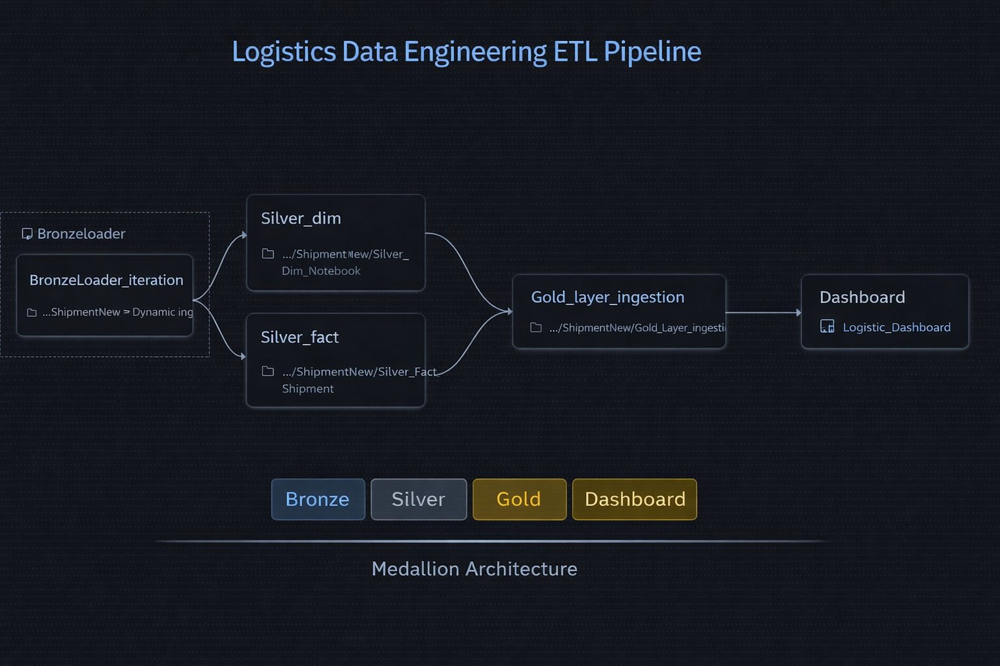
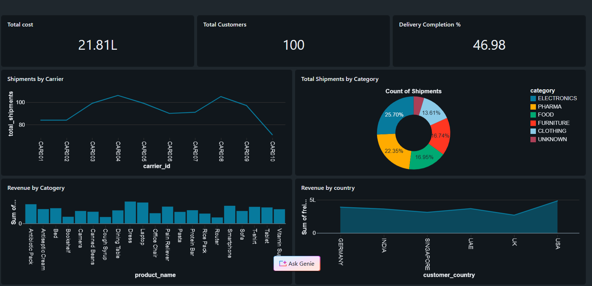

# 🚚 Logistics Shipment Analytics Platform  
### Azure Databricks | PySpark | Delta Lake | Medallion Architecture

A production-grade **Data Engineering project** that simulates a real-world **Logistics Shipment Analytics Platform** built using Azure Databricks and Delta Lake.

The platform incrementally ingests shipment data using **Databricks Auto Loader**, applies data cleaning and transformation logic with **PySpark**, models the data using a **Star Schema**, and serves **Gold analytics tables** for dashboards and reporting.

This project demonstrates modern **cloud data engineering best practices** used in enterprise environments.

---

## 📌 Architecture Overview

```
Source CSV Files
      ↓
Bronze (Auto Loader – Streaming Ingestion)
      ↓
Silver (Cleaning + Validation + Dedup + SCD + MERGE)
      ↓
Gold (Aggregations + KPIs)
      ↓
Power BI / Databricks Dashboard
```

### Pipeline Flow


### Dashboard Preview


---

## ⚙ Tech Stack

- Azure Databricks
- PySpark
- Delta Lake
- Azure Data Lake Storage Gen2
- Databricks Auto Loader (cloudFiles)
- SQL
- Power BI / Databricks SQL Dashboard

---

## 🏗 Medallion Architecture

### 🥉 Bronze Layer – Raw Ingestion
**Purpose:** Reliable, scalable ingestion of raw data

- Streaming ingestion using Databricks Auto Loader
- Incremental file detection
- Schema inference & evolution
- Exactly-once processing
- Stored in Delta format
- Raw, unmodified data

Benefits:
- No full reloads
- Handles large-scale files efficiently
- Production-ready streaming ingestion

---

### 🥈 Silver Layer – Cleaned & Modeled
**Purpose:** Data quality and business transformations

#### Fact Processing
- Trim and uppercase standardization
- Multi-format date parsing
- Null handling
- Duplicate removal (latest record kept)
- Incremental loads using Delta MERGE

#### Dimension Processing
- Type-1 Slowly Changing Dimensions
- Latest record overwrite logic
- Standardization and cleansing

Benefits:
- Trusted, consistent datasets
- Business-ready structure

---

### 🥇 Gold Layer – Analytics
**Purpose:** BI and reporting optimized tables

Pre-built aggregated tables:
- Daily shipments
- Revenue metrics
- Customer summary
- Product summary
- Carrier performance

Benefits:
- Fast queries
- Dashboard ready
- Reduced compute costs

---

## 📂 Data Model

### Fact Table

- fact_shipments

---

### Dimension Tables

- dim_customer
- dim_product
- dim_carrier

Type: Type-1 Slowly Changing Dimensions

---

## 🔄 Pipeline Workflow

### Step 1 – Bronze
Auto Loader streams CSV files into Delta tables

### Step 2 – Silver
Cleaning, deduplication, transformations, Delta MERGE

### Step 3 – Gold
Aggregations and KPI generation

### Step 4 – Dashboard
Power BI or Databricks SQL connects to Gold tables

---

## 📊 KPIs Implemented

- Total Shipments
- Total Revenue
- Active Customers
- On-Time Delivery %
- Revenue by Country
- Shipments by Category
- Carrier Performance

---

## ✅ Engineering Concepts Demonstrated

- Medallion Architecture
- Streaming ingestion with Auto Loader
- Delta Lake MERGE (upserts)
- Incremental processing
- Deduplication strategies
- Type-1 SCD handling
- Star Schema modeling
- Data quality checks
- Scalable cloud storage design
- BI serving layer

---

## 🎯 Skills Showcased

- End-to-end data pipeline design
- Cloud data lake implementation
- Production ETL/ELT engineering
- Performance optimization with Delta
- Analytical data modeling
- Dashboard-ready serving layer

---

## 👨‍💻 Author

Yash Mane  
Data Engineer
